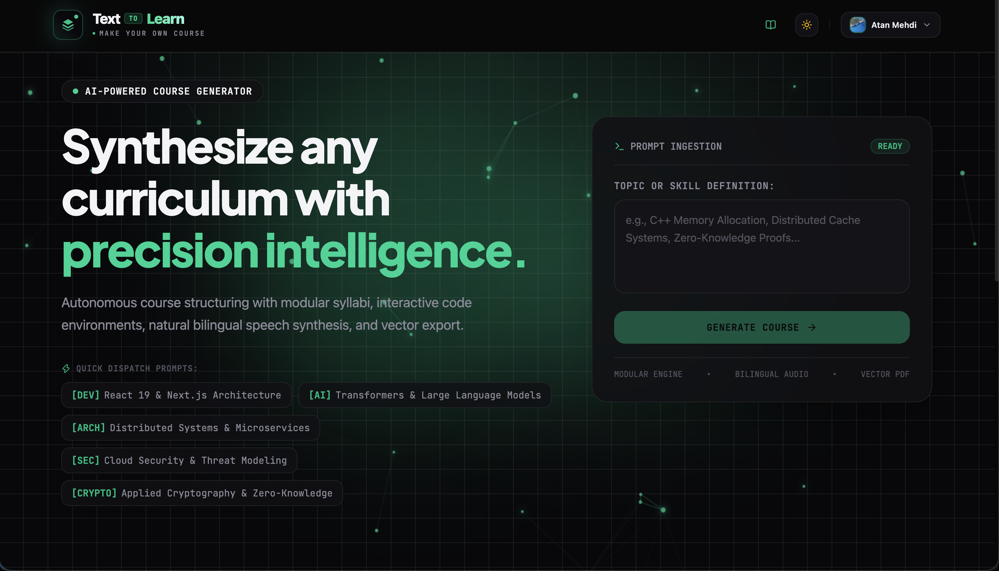
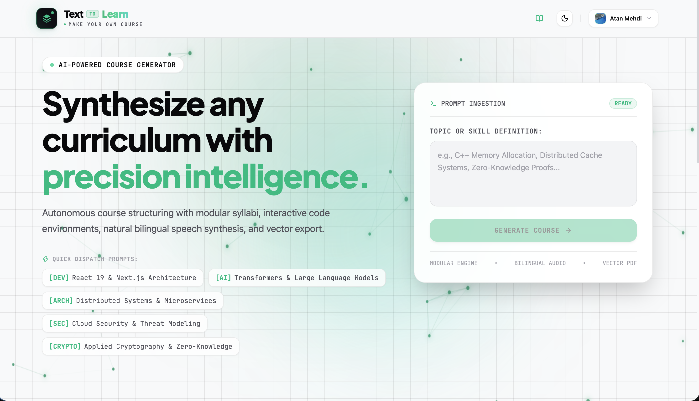
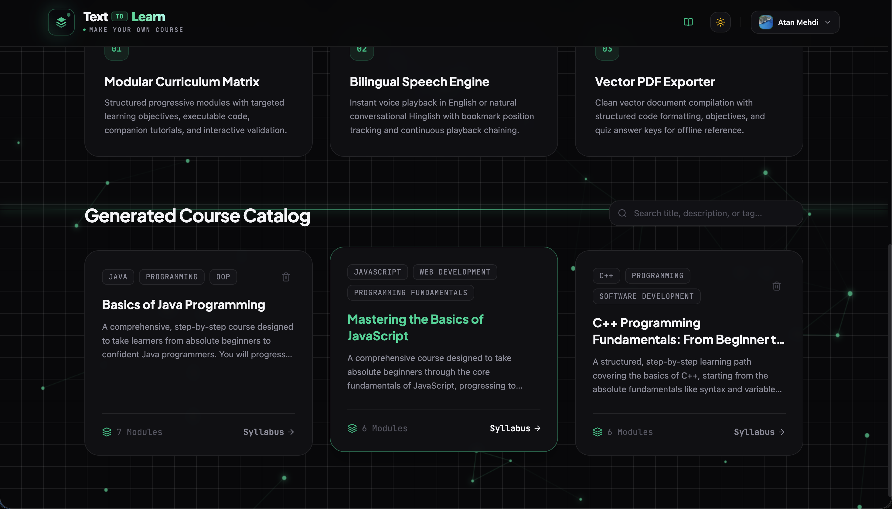
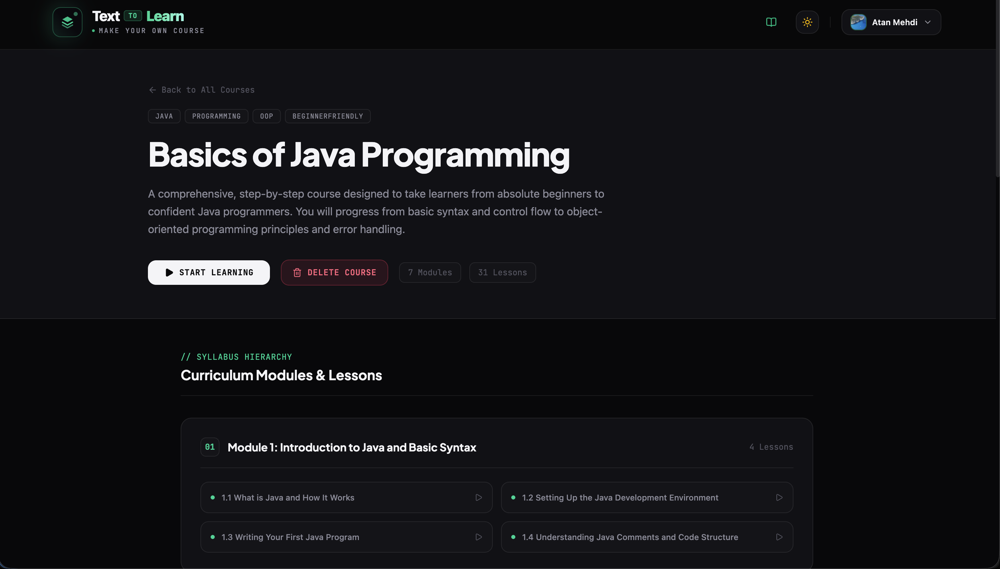
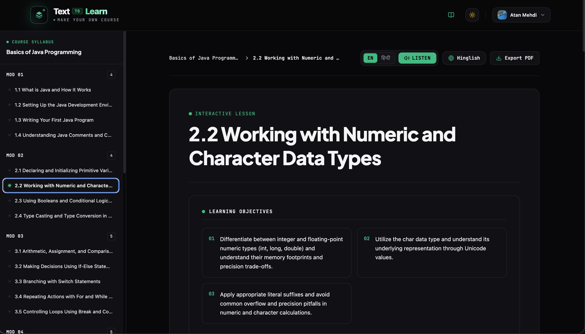
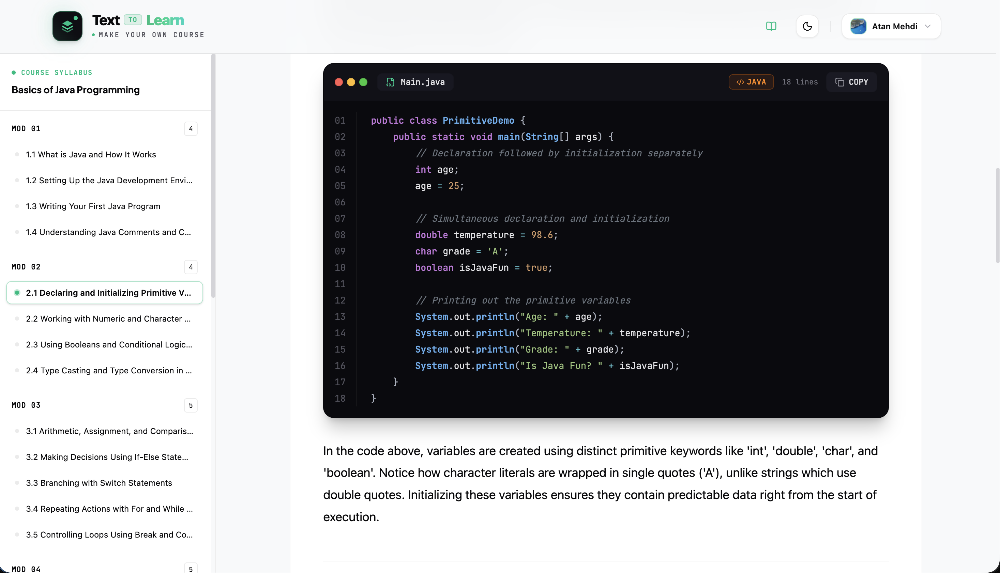
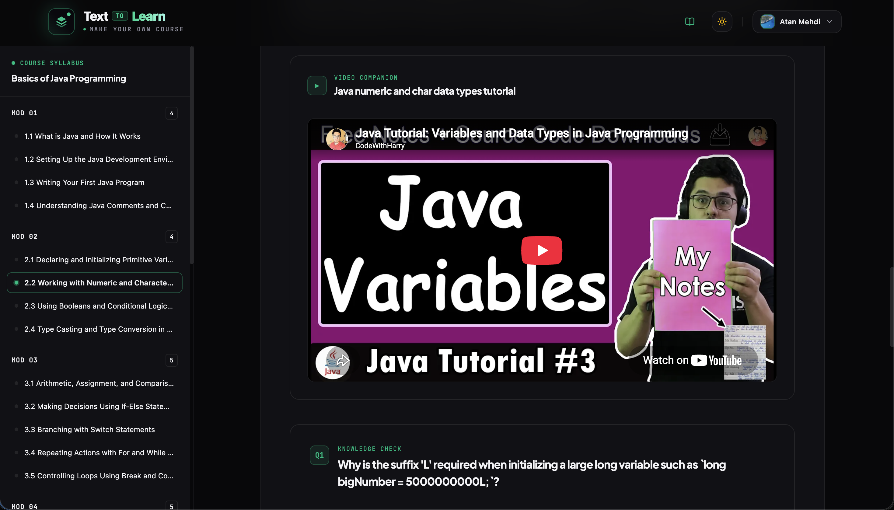
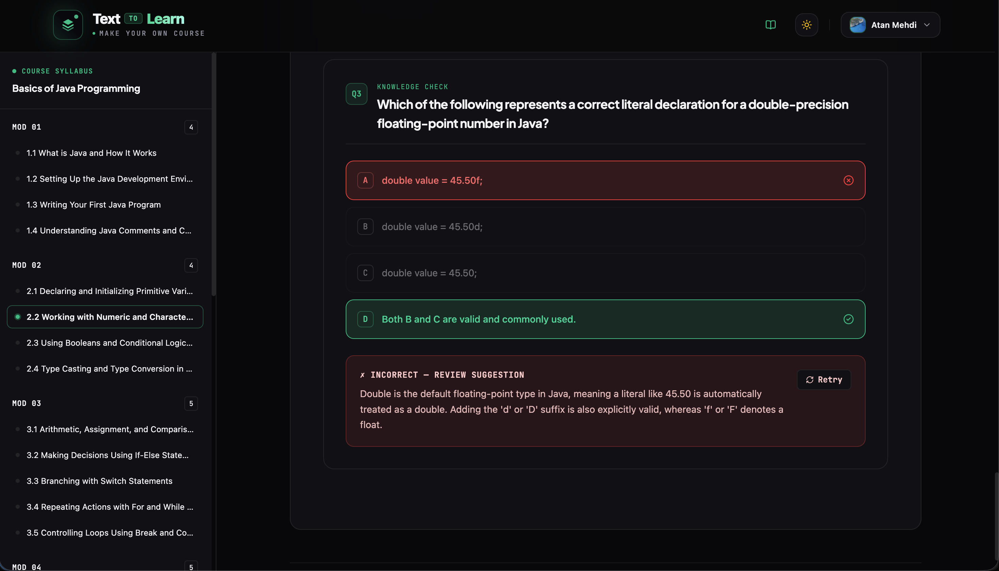

# 🚀 Text-to-Learn

> **AI-Powered Course Generator** — Transform any topic prompt into structured, interactive courses with modular syllabi, bilingual audio narration (English & Hinglish), syntax-highlighted code, video tutorials, quizzes, and PDF export.

🔗 **Live Application:** [https://text-to-learn-beryl.vercel.app](https://text-to-learn-beryl.vercel.app)

---

## 📸 Application Showcase

### 🌓 Dual-Theme Landing & AI Prompt Ingestion
| Dark Theme | Light Theme |
| :---: | :---: |
|  |  |

---

### 📚 Course Catalog & Syllabus Hierarchy
| Dynamic Course Catalog | Syllabus & Module Breakdown |
| :---: | :---: |
|  |  |

---

### 💡 Interactive Lesson Reader & Media Components
| Lesson Header & Bilingual Audio | Syntax-Highlighted Code |
| :---: | :---: |
|  |  |

| Curated Video Companion | Interactive Quizzes & Validation |
| :---: | :---: |
|  |  |

---

## 🌟 Key Features

- **⚡ Instant AI Course Creation**: Generates multi-module course outlines from any prompt via **Google Gemini API**.
- **⏳ Lazy Lesson Generation (On-Demand Loading)**: Synthesizes lightweight course syllabi instantly, generating full lesson content, code, quizzes, and video companions on-demand only when a lesson is opened.
- **⚡ In-Memory LRU Caching**: Thread-safe bounded read-through LRU cache reducing database read latency by ~60% and eliminating duplicate LLM API generation calls.
- **📖 Rich Interactive Lessons**: Conceptual explanations, targeted learning objectives, code examples tailored to the topic language, and interactive validation quizzes.
- **🎙️ Real-Time Bilingual TTS Engine**: In-browser narration in **English** and conversational **Hinglish** with dynamic chunking, audio waveform visualization, and speech controls.
- **🎥 YouTube Video Discovery**: Auto-matches relevant educational tutorials via **YouTube Data API v3** with fallback direct search.
- **🔒 Hybrid Authentication**: Auth0 OAuth2 SSO and native email/password signup secured by **HMAC-SHA256 signed JWTs**.
- **🛡️ Creator Privacy Controls**: Fine-grained access control ensuring private user-generated courses/lessons are restricted to their creator.
- **📄 Vector PDF Export**: Download formatted lesson study guides for offline reading.

---

## 💻 Tech Stack

### Frontend
- **Framework**: React 19, Vite
- **Styling**: Tailwind CSS, CSS Custom Design Tokens
- **Routing**: React Router v7
- **Icons**: Lucide React
- **Audio & PDF**: Web Speech API, jsPDF, html2canvas

### Backend
- **Framework**: Spring Boot 3.3.4 (Java 17)
- **Database**: MongoDB Atlas / Spring Data MongoDB
- **Caching**: Thread-Safe Bounded LRU Cache
- **Security**: Spring Security, JJWT (HMAC-SHA256)
- **AI & External APIs**: Google Gemini API, YouTube Data API v3, Auth0

---

## 🚀 Quick Start (Local Setup)

### Prerequisites
- **Node.js** (v18+) & **npm**
- **Java JDK 17+** & **Maven**
- **MongoDB** instance or connection URI
- **Google Gemini API Key** ([Google AI Studio](https://aistudio.google.com/))

---

### 1. Backend Setup (`/server`)

Create or update `server/src/main/resources/application.properties`:

```properties
server.port=8080

# Gemini API Key
gemini.api.key=YOUR_GEMINI_API_KEY

# YouTube Data API Key (Optional)
youtube.api.key=YOUR_YOUTUBE_API_KEY

# MongoDB Connection
spring.data.mongodb.uri=mongodb+srv://<username>:<password>@cluster0.mongodb.net/texttolearn?retryWrites=true&w=majority

# JWT & Auth0
jwt.secret=YourSuperSecretSigningKeyForJwtAuthentication2026!
auth0.audience=https://your-tenant.us.auth0.com/api/v2/
spring.security.oauth2.resourceserver.jwt.issuer-uri=https://your-tenant.us.auth0.com/
```

**Run the backend:**
```bash
cd server
mvn spring-boot:run
```
*Backend runs on `http://localhost:8080`*

---

### 2. Frontend Setup (`/client`)

Create `client/.env`:

```env
VITE_API_URL=http://localhost:8080
VITE_AUTH0_DOMAIN=your-tenant.us.auth0.com
VITE_AUTH0_CLIENT_ID=your-auth0-client-id
VITE_AUTH0_AUDIENCE=https://your-tenant.us.auth0.com/api/v2/
```

**Run the frontend:**
```bash
cd client
npm install
npm run dev
```
*Frontend runs on `http://localhost:5173`*

---

## 🔌 API Summary

| Endpoint | Method | Description |
| :--- | :--- | :--- |
| `/api/courses` | `GET` | Get all accessible courses |
| `/api/courses/{id}` | `GET` | Get course syllabus by ID |
| `/api/courses/generate` | `POST` | Generate new course outline from prompt |
| `/api/courses/{id}` | `DELETE` | Delete user-created course |
| `/api/lessons/{cId}/{mId}/{lId}` | `GET` | Get or lazy-generate enriched lesson |
| `/api/lessons/{lId}/translate/hinglish` | `POST` | Generate Hinglish explanation |
| `/api/youtube/search` | `GET` | Query YouTube tutorials |
| `/api/auth/register` | `POST` | Register new native user |
| `/api/auth/login` | `POST` | Login & issue signed JWT |
| `/api/auth/me` | `GET` | Get authenticated user profile |
